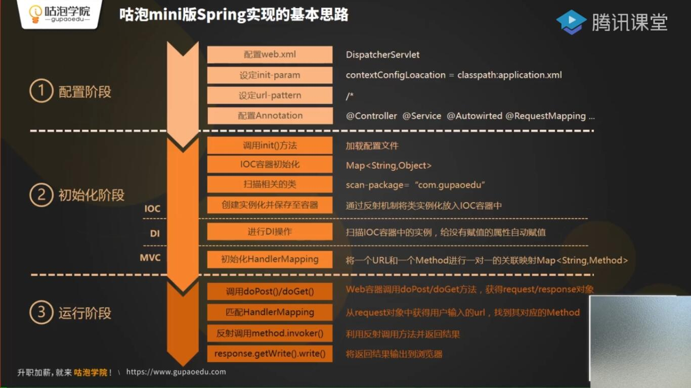

# 手写迷你版SpringMVC
[Spring核心原理剖析,手写Spring,Java架构师进阶【咕泡学院】](https://ke.qq.com/webcourse/466786/100558659#taid=4166328730984290&vid=5285890796228527313)

知识点：File、IO、Servlet、注解、反射、集合框架

实现步骤：

应用程序启动时加载 dispatcherServlet，调用 init 方法

1.加载配置文件

2.扫描类

3.实例化类并保存到IOC容器中

4.完成依赖注入

5.初始化HandlerMapping

6.派遣

